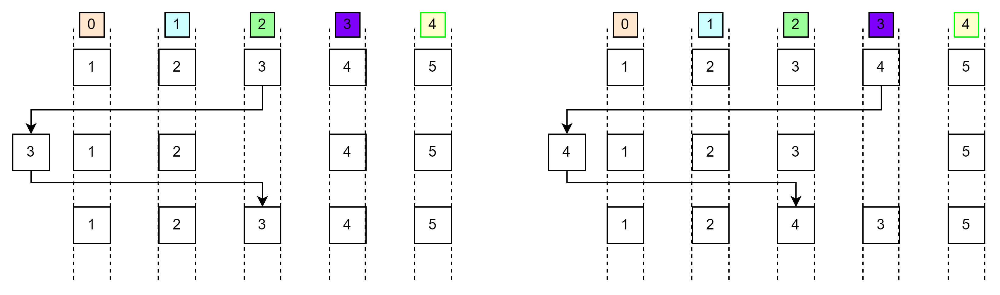

# Code cheat seat

### 1. np.rollaxis(a, axis, start=0): Roll the specified axis backwards, until it lies in a given position 

- if the axis <= start, the axis will be placed after start.
- if the axis > start, the axis will be placed right at the start.

-------------------------------------------------------
Draw.io link: https://drive.google.com/file/d/1DXJtX9671kJcpLC4FPjQyEheL77YWqrP/view?usp=sharing